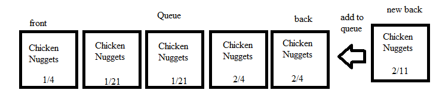

# Queues

## Introduction

In a restaurant, there is a need to rotate stock to make sure that the oldest food is used first. If they do not do this, food will go bad and money will be wasted. Typically a "First in, First Out" or FIFO system is used. This is where boxes are dated and the oldest stock is rotated to be used first, etc. This structure is used in programming too, and it is called a queue. A queue is a data structure where the oldest stock, or the first position of the data structure is used first, then the next, ect.

## Disney Land: Queues in Action

An example of this can also be seen in amusement parks, such as Disney Land. Every ride in an amusement part typically has a line of people wanting to ride the ride. This line is a queue. It can be simulated in Python as follows:

## Queue Types

Description

## Example in Python: Deck of Cards

Description

## Problem to Solve: Black Jack/Disney Land

Description
