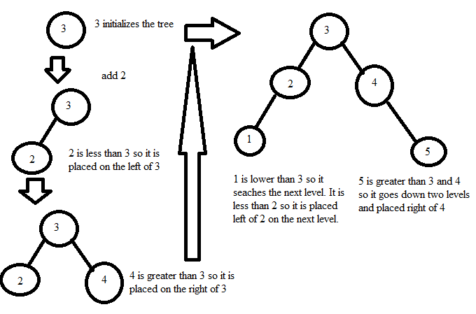

# Trees

## Introduction

Trees are a data structure that deals primarity with sorting numbers in O(log n) notation. In essence it takes a number, stores it, then the next numbers are placed either above or below it according to their value. If they are below, they'll go down the left side of the tree and, if there is free space, create a new node. Otherwise they'll continue to compare values until a new node can be completed.

## Recursion

In order to accomplish this, recursion is required. Recursion is when a program calls itself to create a step by step repetitious process. An example of where programming would need recursion is in searching. Say, in a list of 0 to 100, you are trying to find a random number that the computer has randomly selected. We could search one by one from 0 to 100, or, we could split the list in half every time:
Chosen number: 42:
One by one: 1 (higher), 2 (higher), 3 (higher)... 42 (takes 42 guesses)
Splitting in half: 50 (lower), 25 (higher), 37 (higher), 43 (lower), 40 (higher), 41 (higher), 42 (7 guesses)

How would this be programmed in Python?

```python
def search(guess, starting_range, ending_range):
    if starting_range == ending_range:
        print(f"Number Found! {starting_range}.")
    else:
        middle = (ending_range+starting_range) //2
        if guess == middle:
            print(f"Number found! {middle}.")
        elif guess > middle:
            print(f"Number is greater than {middle}.")
            search(guess, middle, ending_range)
        elif guess < middle:
            print(f"Number is less than {middle}.")
            search(guess, starting_range, middle)
```
Output:
Number is less than 50.
Number is greater than 25.
Number is greater than 37.
Number is less than 43.
Number is greater than 40.
Number is greater than 41.
Number found! 42.

## Balancing Act: The Balance of a Tree

Recruision is used in a tree to find a free spot. Let's make a tree with the following numbers: 3, 2, 4, 1, 5:


## The Read & Write of a Tree

Description

## Problem to Solve: Creating a BST in Python

Description
