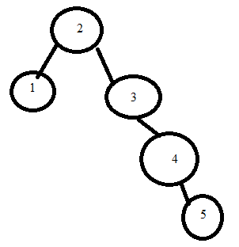

# Trees

## Introduction

Trees are a data structure that deals primarity with sorting numbers in O(log n) notation. In essence it takes a number, stores it, then the next numbers are placed either above or below it according to their value. If they are below, they'll go down the left side of the tree and, if there is free space, create a new node. Otherwise they'll continue to compare values until a new node can be completed.

## Recursion

In order to accomplish this, recursion is required. Recursion is when a program calls itself to create a step by step repetitious process. An example of where programming would need recursion is in searching. Say, in a list of 0 to 100, you are trying to find a random number that the computer has randomly selected. We could search one by one from 0 to 100, or, we could split the list in half every time:
Chosen number: 42:
One by one: 1 (higher), 2 (higher), 3 (higher)... 42 (takes 42 guesses)
Splitting in half: 50 (lower), 25 (higher), 37 (higher), 43 (lower), 40 (higher), 41 (higher), 42 (7 guesses)

How would this be programmed in Python?

```python
def search(guess, starting_range, ending_range):
    if starting_range == ending_range:
        print(f"Number Found! {starting_range}.")
    else:
        middle = (ending_range+starting_range) //2
        if guess == middle:
            print(f"Number found! {middle}.")
        elif guess > middle:
            print(f"Number is greater than {middle}.")
            search(guess, middle, ending_range)
        elif guess < middle:
            print(f"Number is less than {middle}.")
            search(guess, starting_range, middle)

search(42, 0, 100)
```
Output:
Number is less than 50.
Number is greater than 25.
Number is greater than 37.
Number is less than 43.
Number is greater than 40.
Number is greater than 41.
Number found! 42.

While this may seem of only slight significance, let's try a number between 0, 10,000,000; 8,675,309:
Output:
Number is greater than 5000000.
Number is greater than 7500000.
Number is less than 8750000.
...
Number is less than 8675316.
Number is less than 8675311.
Number found! 8675309.
(Only 22 guesses compared to 8,675,309 guesses)

## Balancing Act: The Balance of a Tree

Recruision is used in a tree to find a free spot. Let's make a tree with the following numbers: 3, 2, 4, 1, 5:


However, some trees can be inbalanced. What if we did the same tree but the 2 and 3 were switched: 2, 3, 4, 1, 5:



Unlike the previous, this tree is imbalanced, where it has a much longer right side. The more imbalanced a tree is, the least effecient it is. If we have a tree of 1-7 for example, we could either have:


The left tree is very efficient, only having 3 levels, but the right might as well be a normal list.

We can see from the left tree that balancing a range of information starts with the center value (4 with 1-7), then each side starts with the center of their respective sides (2 for 1-3, and 6 for 5-7). This is how to best balance a tree is to take the middle, make it the top node, then seperate the remaining values, continuously finding the middle for the top node.

## The Read & Write of a Tree

Trees are a great way to store objects by user ID, allowing searching to be O(log n) instead of going one by one in a potentially high volume system. Let's say a system has 1,000 IDs. Searching one-by-one would take 1000 iterations in a for loop in the worst-case scenario, whereas with a tree that uses O(log n), it would take, at most, 10 iterations.


## Problem to Solve: Creating a BST in Python

[Follow these instructions](www.youtube.com)
